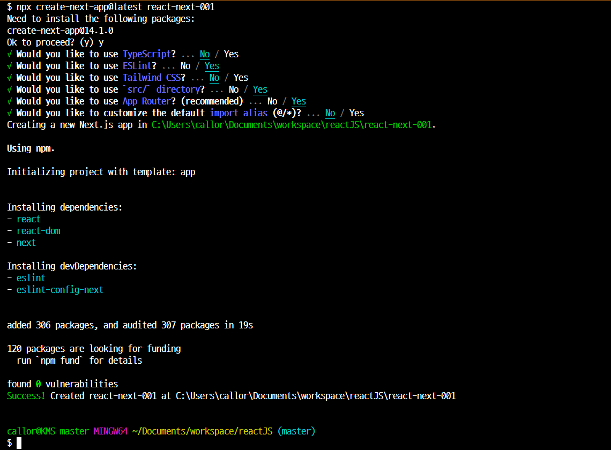

# ReactJS 프로젝트

- React v18 를 활용한 Front-End 프로젝트
- `npx create-react-app 프로젝트명` : `create-react-app` 도구를 최신버전을 다운로드 받아(npx)서 `프로젝트명` 프로젝트를 생성하라
- `React` : 순수한 JS 를 이용한 Front-End 개발 도구

## React 프로젝트 만들기

### 기본 개발도구만 설치된 프로젝트 만들기

- `npx create-react-app --template=empty 프로젝트명`

### React 의 기본 Template(Sample)가 포함된 프로젝트 만들기

- `npx create-react-app 프로젝트명`

## NextJS 프로젝트

- `React` 와 `NextJS` Framework 가 적용된 프로젝트 생성하기

```bash
npx create-next-app@latest [프로젝트]
npm init next-app [프로젝트]
yarn create-next-app [프로젝트]
```

- 명령 실행 후 옵션 선택하기
  
